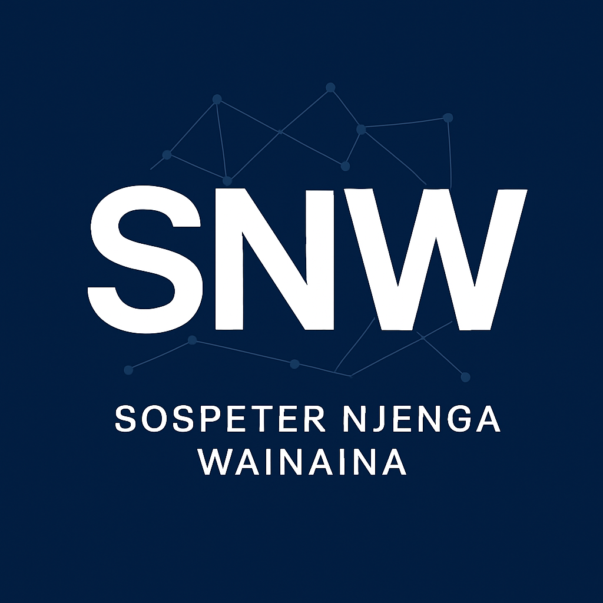

<!-- Favicon -->
<link rel="icon" href="favicon.ico" type="image/x-icon" />

<!-- Centered Logo -->

  

# 👋 Hi, I'm Sospeter Njenga

Aspiring Data Scientist and BSc. Statistics graduate passionate about forecasting, financial analytics, and Python-based modeling. I enjoy transforming data into insights and building full-stack analytics solutions from scratch.

---

## 🚀 Featured Projects

### 🛒 Smart Retail Analytics  
A full-stack retail analytics project including SQL Server DB design, synthetic data generation, sales forecasting, customer segmentation, and an interactive Streamlit dashboard.

- 📂 [View GitHub Repository](https://github.com/SOSPETER03/smart-retail-analytics)  
- 📄 [Project Report PDF](https://github.com/SOSPETER03/smart-retail-analytics/blob/main/SmartRetailAnalytics_Portfolio_Report.pdf)  
- 📊 [Dashboard Snapshot PDF](https://github.com/SOSPETER03/smart-retail-analytics/blob/main/Streamlit.pdf)

---

### 📈 Tesla Stock Forecasting  
A full-cycle stock prediction pipeline using ARIMA, SARIMA, LSTM, and hybrid models. Includes interactive charts, diagnostics, and professional documentation.

🔗 [View Documentation →](https://sospeter03.github.io/tesla-stock-forecasting)

---

## 💼 Skills

- Time Series Forecasting (ARIMA, SARIMAX, LSTM)
- Data Analytics & Visualization (Python, pandas, seaborn, plotly)
- Machine Learning (scikit-learn, KMeans, regression)
- Deep Learning (Keras, TensorFlow)
- Business Intelligence (Power BI, Excel, Tableau)
- Database & SQL (SQL Server, SQLite, PyODBC)
